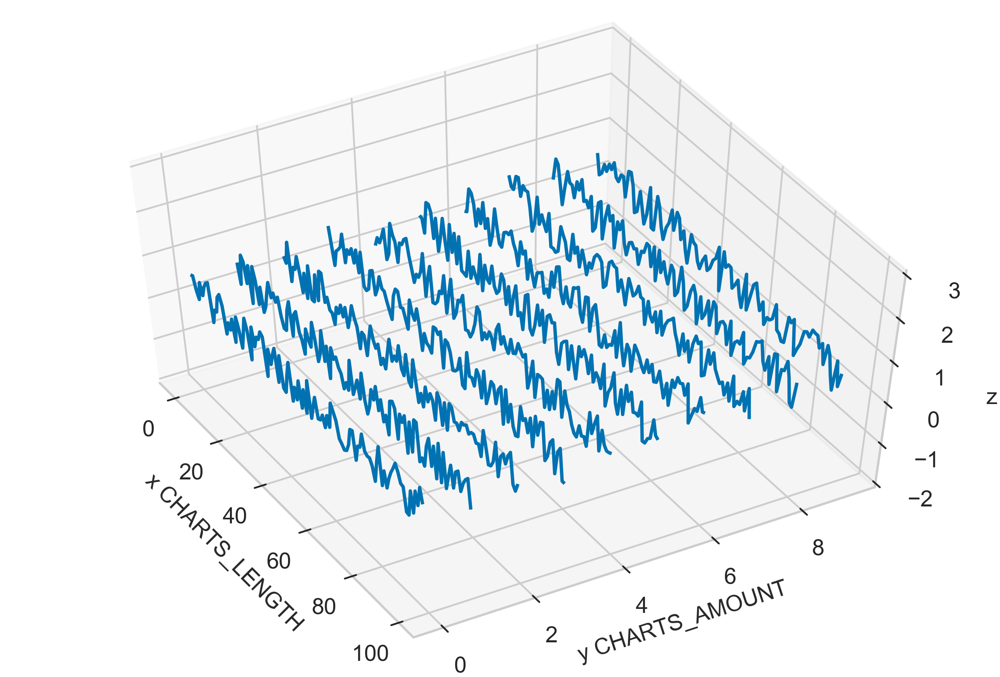
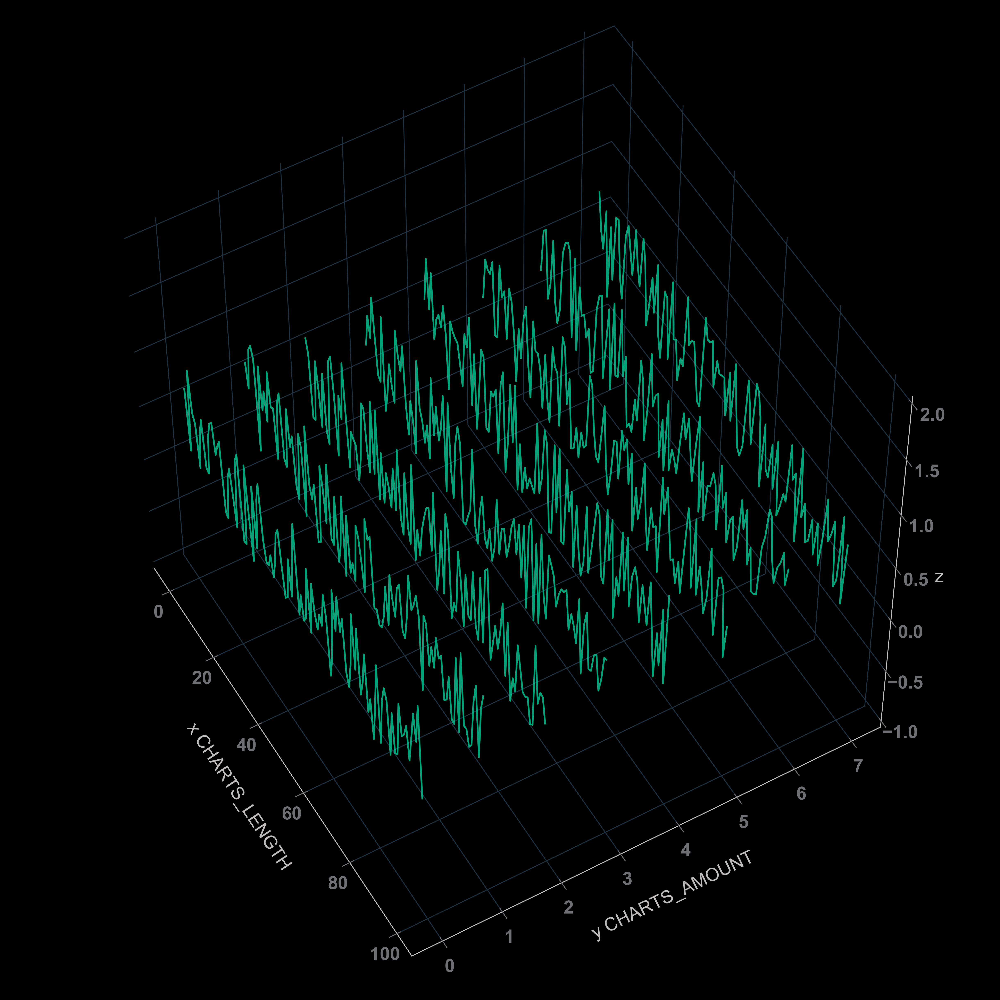

# 2D-live-charts-in-3D-space

To create 2d line charts in 3d space, check `2d-charts-in-3d.ipynb`.

Text version tutorial (MEDIUM): https://medium.com/@bridges.dev.create/2d-live-charts-in-3d-space-be5bd47b534f?sk=96e48ee3a2fdc0b4886fc7e7fbbd5cb5

---

To update 3d graph in real time (live graph), check `2d-live-charts-in-3d.ipynb`.

---

To style figures, check `2d-charts-in-3d-style.ipynb`.

### Resources:

- mplot3d tutorial: https://matplotlib.org/mpl_toolkits/mplot3d/tutorial.html